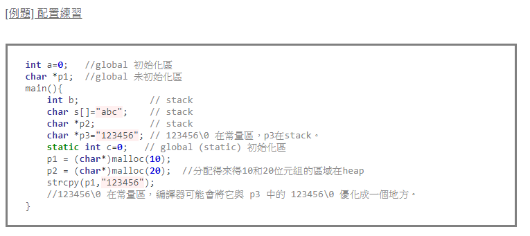
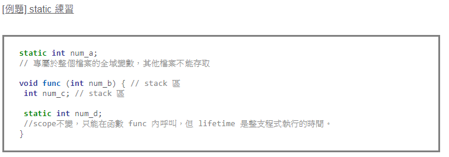
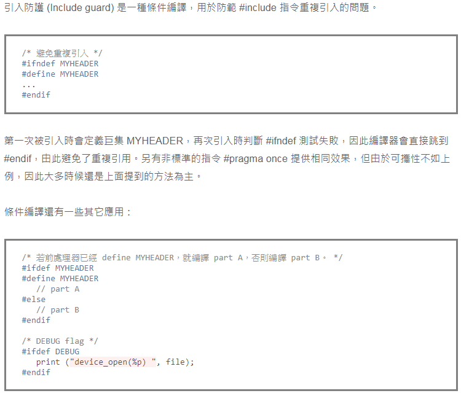
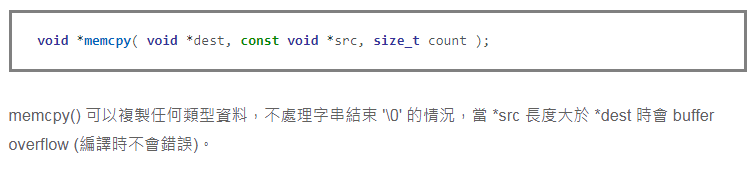
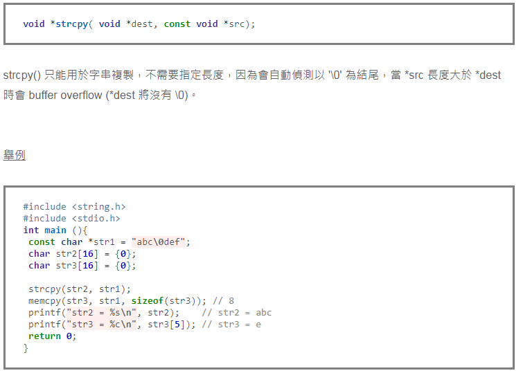
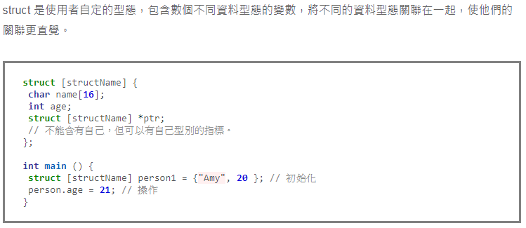
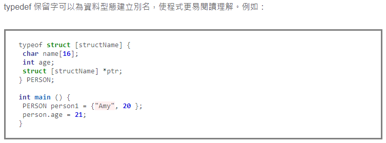
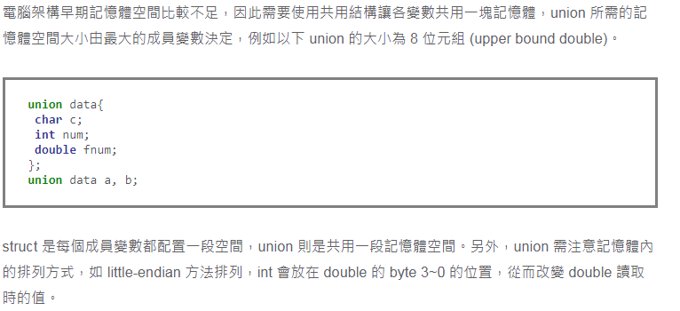
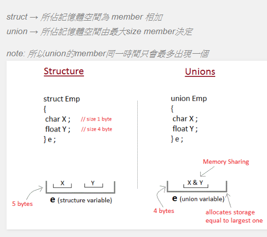

# 基本指標判讀:
```
int a; // 一個整型數
int *a; // 一個指向整數的指標
int **a; // 一個指向指標的指標，它指向的指標是指向一個整型數
int a[10]; // 一個有10個整數型的陣列
int *a[10]; // 一個有10個指標的陣列，該指標是指向一個整數型的
int (*a)[10]; // 一個指向有10個整數型陣列的指標
int (*a)(int); // 一個指向函數的指標，該函數有一個整數型參數並返回一個整數
int (*a[10])(int); // 一個有10個指標的陣列，該指標指向一個函數，該函數有一個整數型參數並返回一個整數

注意宣告兩個指標時不能寫做 int* a, b; 因為前式等價於 int* a; int b;。連續宣告兩個指標用 int *a, *b;
```
  
  
  
  
# 指標與其他關鍵字混用
```
一樣右讀到左，例如：
	const int * foo; // 一個 pointer，指向 const int 變數。
	int const * foo; // 一個 pointer，指向 const int 變數。
	int * const foo; // 一個 const pointer，指向 int 變數。
	int const * const foo; // 一個 const pointer，指向 const int 變數。	
關鍵字 volatile 等等判讀方式相同。
```
  
      
    
# 變數範圍和生命周期（關鍵字 static）
```
1. local 變數 : local 變數僅活在該函式內，存放位置在 stack 或 heap 記憶體中。

2. static 變數 : static 變數生命周期 (life time) 跟程式一樣長，而範圍 (scope) 則維持不變，即在宣告的函式之外仍無法存取 static 變數。

3. global 變數 : 所有區段皆可使用此變數。
```
```
Stack : 存放函數的參數、區域變數等，由空間配置系統自行產生與回收。(會稱作 stack 是由於其配置遵守 LIFO)
Heap : 一般由程式設計師分配釋放，執行時才會知道配置大小，如 malloc/new 和 free/delete。(注意其資料結構不是 DS 中的 heap 而是 link-list)
Global : 包含 BSS (未初始化的靜態變數)、data section (全域變數、靜態變數) 和 text/code (常數字元)。
```
> 
>     
  
  
    
# call by value, call by reference
```
1. call by value : 最常見的函式寫法，呼叫者和被呼叫者的變數各自佔有記憶體，將參數複製再傳給函式。

2. call by reference : 呼叫者和被呼叫者的變數使用相同的記憶體位址，因此在被呼叫函式中改變變數時，變動結果會保留。(C++ 才有，寫法為 type func(type &var) { ... })
```
  
    
      
# 關鍵字 const
```
const 通常表示只可讀取不可寫入的變數，常用來宣告常數。使用 const 有以下好處：
	1.提升程式碼可讀性
	2.使編譯器保護那些不希望被改變的參數
	3.給優化器一些附加的資訊	
```
   
      
        
# const vs #define
```
編譯器處理方式 : define 在預處理階段展開；const 在編譯階段使用。
類型和安全檢查 : const 會在編譯階段會執行類型檢查，define 則不會。
存儲方式 : define 直接展開不會分配記憶體，const 則會在記憶體中分配。
```
  
    
      
# 巨集 #define
>    
       
  
     
# 引入防護和條件編譯
> 
  
    
      
# 關鍵字 inline
```
inline 可以將修飾的函式設為行內函式，即像巨集 (define) 一樣將該函式展開編譯，用來加速執行速度。

inline 和 #define 的差別在於：
inline 函數只對參數進行一次計算，避免了部分巨集易產生的錯誤。
inline 函數的參數類型被檢查，並進行必要的型態轉換。
巨集定義盡量不使用於複雜的函數
用 inline 後編譯器不一定會實作，僅為建議。
```

    
      
# 關鍵字 volatile
```
由於嵌入式系統常處理 I/O、中斷、即時操作系統 (RTOS) 相關的問題，因此在嵌入式系統開發中 volatile 尤為重要。被 volatile 修飾的變數代表它可能會被不預期的更新，因此告知編譯器不對它涉及的地方做最佳化，並在每次操作它的時候都讀取該變數實體位址上最新的值，而不是讀取暫存器的值。

volatile 常見的應用：

修飾中斷處理程式中 (ISR) 中可能被修改的全域變數。
修飾多執行緒 (multi-threaded) 的全域變數。
設備的硬體暫存器 (如狀態暫存器)
```
  
  
# 記憶體複製
>   
  
  
    
# 字串複製
> 
  
  
  
# 結構 struct  
> 
  
  
  
# 重新定義型態名稱 typedef 
> 
  
  
  
# 列舉 enum
> 
  
  
  
# 共用結構 union
> 
  
      
        
# 寫出將會印出的兩行字串
> 
```
答案為:
第一行字串為 : 0113234
第二行字串為 : 0123456

首先, *p = s 所代表的含意為 pointer p 指向字串s的第一個位址,
字串s第一個位址值為0,而接下來一連串的運算可分成以下四類:
```
> 
```
雖然看似複雜,但仔細觀察還是可看出規則,
*p = 取值
p = 取指標位址
++在前  =  先加1再取值
++在後  =  先取值後加1
```
  
    
    
# write your own strcmp 
``` 
int ownstrcmp(char a[], char b[])  
{   
   int i = 0; 
   while( a[i] == b[i] )   
   { 
      if( a[i] == '\0' )  
        return 0; 
      ++i; 
   } 
   return  ( a[i] < b[i]) ? 1 : -1; 
}   
```
  
  
  
# 請問以下何者為不合法的變數名稱?
#### 1. _aB        2. AB        3. 2ab        4. A_B        5. Black        6.  Break
```
Ans: 3
(Note : 第六選項  "Break" 因為是大寫 B 與 "break"被視為兩個不同的變數，故雖不建議使用，但依然被視為合法變數)
1. 變數名稱可為任何英文與數字的組合 (包含底線 __ )
2. "保留字" 不可為變數名稱 如: goto 、   break 、   case ....等等
```
> 
  

  
# Compare array and list
```
std::array is just a class version of the classic C array. 
That means its size is fixed at compile time and it will be allocated as a single chunk 
(e.g. taking space on the stack). The advantage it has is slightly better performance because there 
is no indirection between the object and the arrayed data.  

std::vector is a small class containing pointers into the heap. (So when you allocate astd::vector, 
it always calls new.) They are slightly slower to access because those pointers have to be chased to 
get to the arrayed data... But in exchange for that, they can be resized and they only take a 
trivial amount of stack space no matter how large they are.
```

# Explain Static and volatile  
### Static:

(1) 修飾檔案中的global variable：
> 使這個變數只有在本檔案中才可以被使用，相同專案中的其他檔案看不到它的存在。補：放在function前也有一樣的作用。

(2) 修飾function中的local variable：
> 此變數一旦經過初始化就會一直存在直到程式結束，跳出function時它也會保持當下的值，ex. 可用來計算同一個function被呼叫的次數。只會被初始化一次，並且只有進入function中才看得到這個變數 !!

(3) 修飾class中的member variable和function：
> variable：會使同一個class的所有實體共用同一個member variable，或者說這個member variable在同一個class的所有實體擁有相同的值。
> 一樣只會初始化一次，甚至不需要實體就可呼叫。

function：static member function不屬於任何一個實體，也是不需要實體就可呼叫，
>> 但它只能操作static member variables而已。他們都透過 :: 運算子來呼叫，表示屬於某一個class但不屬於任何實體。 ex. A::x 也可以透過實體用

### Volatile:

> 被volatile修飾的變數代表它的值有可能因為編譯器不知道的因素修改，所以告訴編譯器不要對它涉及的地方做最佳化，並在每次操作它的時候都去讀取該變數實體位址上最新的值，而不是讀取CPU暫存器上的值，一般的變數可能因為剛剛讀取過而放在CPU暫存器上使動作變快。

>> 例子：(1) 硬體暫存器，如狀態暫存器。(2) 多執行緒所共用的全域變數。(3) 中斷服務函式 (Interrupt Service Rountie，ISR)所使用的全域變數。

囧~ 我只能了解多執行緒的情況，其他兩個例子都沒概念。


# C/C++中的volatile使用時機?
### A: 使用時機有兩個場合(I/O & multithread program)
> 1. I/O
```
假設有一程式片斷如下
U8 *pPort;
U8 i, j, k;
pPort = (U8 *)0x800000;
i = *pPort; 
j = *pPort; 
k = *pPort; 

以上的i, j, k很有可能被compiler最佳化而導致產生
i = j = k = *pPort;
的code, 也就是說只從pPort讀取一次, 而產生 i = j = k 的結果, 但是原本的程式的目
的是要從同一個I/O port讀取3次的值給不同的變數, i, j, k的值很可能不同(例如從此
I/O port 讀取溫度), 因此i = j = k的結果不是我們所要的

怎麼辦 => 用volatile, 將
U8 *pPort;
改為
volatile U8 *pPort;

告訴compiler, pPort變數具有揮發性的特性, 所以與它有關的程式碼請不要作最佳化動作. 因而 
i = *pPort; 
j = *pPort; 
k = *pPort; 
此三列程式所產生的code, 會真正地從pPort讀取三次, 從而產生正確的結果
```

> 2. Global variables in Multithread program 
```
=> 這是在撰寫multithread program時最容易被忽略的一部份
=> 此原因所造成的bug通常相當難解決(因為不穩定)

假設有以下程式片斷, thread 1 & thread 2共用一個global var: gData 
thread 1: thread 2: 

... .... 
int gData; extern int gData; 

while (1) {
	int i, j, k; 
	for (i = 0; i < 1000; i++)
	gData = rand(); { 
	/* A */
	} 
	j = gData; 
} 

在thread 2的for loop中, 聰明的compiler看到gData的值, 每次都重新從memory load到register, 
實在沒效率, 因此會產生如下的code(注意,tmp也可以更進一步的用register取代):
tmp = gData;
for (i = 0; i < 1000; i++ 
{ 
/* A */
j = tmp; 
.... 
} 
也就是gData只讀取一次, 這下子問題來了, 說明如下:
.thread 2在執行for loop到j = gData的前一列(A)的時候(假設此時gData=tmp=5), 被切換到thread 1執行
.在thread 1的while loop中透過gData = rand(), 對gData做了修改(假設改為1), 再切換回thread 2執行
.繼續執行 j = gData, 產生j = 5的結果
.但是正確的結果應該是 j = 1
怎麼辦 => 也是用volatile,

在thread 1中, 將
int gData; 
改為
volatile int gData; 

在thread 2中, 將
extern int gData; 
改為
extern volatile int gData; 
```

# 以下輸出為何?
```
printf("size of BYTE = %d\n
  	size of float = %d\n
   	size of unsigned int = %d\n
  	size of int = %d\n
  	size of double = %d\n
  	size of unsigned char = %d\n
  	size of char = %d\n" 
  	,sizeof(BYTE)
  	,sizeof(float)
  	,sizeof(unsigned int)
  	,sizeof(int)
  	,sizeof(double)
  	,sizeof(unsigned char)
  	,sizeof(char));
```
```
A:
size of BYTE = 1
size of float = 4
size of unsigned int = 4
size of int = 4
size of double = 8
size of unsigned char = 1
size of char = 1				
```
型別           | 符號位元  | 位元長度 | 表示方法 | 數值範圍
---------------|:--------:|--------:| -------:|------------------------
整數    | 有    |  16或32  |    int | -2147483648 ~ 2147483647
   .     |  .     |  8 |  char | -128 ~ 127
   .     |  .     | 16 |  char | -32768 ~ 32767
   .     |  .     |  32 |  long | -2147483648 ~ 2147483647
   .     |  .     | 64 |  long long | 
   .     | 無    |  16或32  |  unsigned int | 0 ~ 4294967295
   .    |   .    |  8 | unsigned char | 0 ~ 256
   .     |  .     | 16 | unsigned char | 0 ~ 65535
   .     |  .     |  32 | unsigned long | 0 ~ 4294967295
   .     |  .     | 64 |  long long |  
浮點數   | 有    |  32 |  float | 10^-38~10^38
   .     |  .     | 64 |  double | 10^-308~10^308
字元    | 有 |  8 |  char | -128 ~ 127
   
  
  
  
# 請試著寫出下面代碼的輸出:
```
view plaincopy to clipboardprint?
#include 
#include 

int main() 
{ 
char strAry[] = "This is string"; 
char *aryPtr = strAry; 
int *intPtr = (int*)strAry; 
printf("\t[Line01] strAry=%s\n", strAry); 
printf("\t[Line02] aryPtr=%s\n", aryPtr); 
//printf("\t[LineX] *aryPtr=%s\n", *aryPtr); // Segment fault 
printf("\t[Line03] sizeof(aryPtr)=%d\n", sizeof(aryPtr)); 
printf("\t[Line04] sizeof(*aryPtr)=%d\n", sizeof(*aryPtr)); 
printf("\t[Line05] *aryPtr='%c'\n", *aryPtr); 
printf("\t[Line06] *aryPtr+1='%c'\n", *aryPtr+1); 
printf("\t[Line07] *(aryPtr+1)='%c'\n", *(aryPtr+1)); 
printf("\t[Line08] sizeof(intPtr)=%d\n", sizeof(intPtr)); 
printf("\t[Line09] sizeof(*intPtr)=%d\n", sizeof(*intPtr)); 
printf("\t[Line10] intPtr=%s\n", intPtr); 
//printf("\t[LineX] *intPtr=%s\n", *intPtr); // Segment fault 
printf("\t[Line11] *intPtr='%c'\n", *intPtr); 
printf("\t[Line12] *intPtr+1='%c'\n", *intPtr+1); 
printf("\t[Line13] *(intPtr+1)='%c'\n", *(intPtr+1)); 
return 0; 
} 
```
```
A:
 strAry=This is string # 字串陣列 char[] ="..." 會自動加上 NULL 到結尾.  
 aryPtr=This is string # 同上, 只是把 aryPtr 指標指向 strAry 的位置. strAry 本身也是個指標.  
 sizeof(aryPtr)=4 # 指標的大小根據系統是 32bit (4byte) 或是 64bit(8bypte) 有所不同.  
 sizeof(*aryPtr)=1 # char 的大小為 1 byte.  
 *aryPtr='T' # 指向字串中第一個字元 'T'  
 *aryPtr+1='U' # char 'T' + 1=char 'U'. -> ASCII 'T'=84. 84+1=85=ASCII 'U'.  
 *(aryPtr+1)='h' # 將 aryPtr 指標移動一個 char 的位置 (1 個 byte 的距離), 即是字串的第二個字元 'h'.  
 sizeof(intPtr)=4 # 同 Line03  
 sizeof(*intPtr)=4 # int 類型的大小為 4 byte.  
 intPtr=This is string # 雖然用 int* 指定 pointer 類型, 但是在 printf 使用 '%s', 故還是打印出字串出來.  
 *intPtr='T' # 指向字串中第一個字元 'T'.  
 *intPtr+1='U' # 同 Line6  
 *(intPtr+1)=' ' # 因為 指標類型為 int, 故移動一個位置為 4 byte, 所以指向第 0+4 =4 位置上的字元, 即字串的第五個字元 (從 0 開始).  
```
  
  
  
# virtual:
```
	只要基類在定義成員函數時已經聲明了virtue關鍵字，在派生類實現的時候覆蓋該函數時，virtue關鍵字可加可不加，不影響多型實現
```
  
  
  
# const int* p 和 int* const q 兩者之差別  
	1. 前指標指的內容不可變動，後指標不可變動
	2. void dp()const; \\我不會更改成員
	3. const int* op() const{return &data;}  //回傳const參考 保證不會更改
  
  
  
# 以下題目的輸出是  

```
	A: 5
	因為a+1指向a的第二個元素，[3]表示再向後移動3個元素
	a+1是跳一個int的大小(a想成指標)
	&a+1是跳一整個array的大小
```
  
   
# 指標與陣列的差別?
```
	就記憶體方向來看，"指標"所用的記憶體位置不為連續，而"矩陣"所配置的空間為連續。
```
   
  
  
# 試寫出一個Macro求出兩數之最大值。
```
	#define MAX(a,b)   ((a)>= (b) (a):(b))
```
  
  
# 以下程式的輸出的是?  
```
#define SUM(a,b)  a+b
printf(SUM(2,5)*10); 
```
```
	A: 2+5*10=52
```
  
  
  
  
#  寫出一個字串拷貝程式： void StrCpy(char* dst , char* src) ;
```
	void strcpy(char *s, char *t)  // array version
  	{
    		int i;
    		i = 0;
    		while((s[i] = t[i]) != '\0')
   			i++;
  	}
	
	or
	
	void strcpy(char *s, char *t)  // pointer version
  	{
    		while((*s = *t) != '\0') {
   			s++;
   			t++;
    		}
  	}
```
  
  
  
# 程式輸出是多少?
```
	int  fun(int x)
        {
          int count = 0 ;

           while(x){
             count++ ;
             x = x & (x-1) ;
          }
          return count ;
        }
       若x=456;則return值為多少？
```
```
	A: 4
```

# 程式輸出是多少? 
 ``` 	
 	void func(void){
        	static int i = 0 ;
          	i++ ;
          	printf("%d" , i ) ;
        }
	int main() {	
		for(int i=0;i<10;i++)
			func();
		return 0;	
	}
 ```
 ```
 	A: 12345678910
 ```
   
   
   
   
 # 程式輸出
 ```
 	void foo(void)
	{	
    		unsigned int a = 6;
    		int b = -20;
    		(a+b > 6) ? puts(“> 6″) : puts(“<= 6″);
	}
 ```
 ```
 	A: “> 6″
	原因是當表達式中存在有符號類型和無符號類型時, 
	所有的操作數都自動轉換為無符號類型。
	因此-20變成了一個非常大的正整數，所以該表達式計算出的結果大於6。
 ```
   
   

# c=多少?
```
	int a = 5, b = 7, c;
	c = a+++b;
```
```
	上面的程式碼被處理成︰
	c = a++ + b;

	因此，這段程式碼持行後
	a = 6, b = 7, c = 12
```

# 請說明 C/C++ 字串格式化內容與指標使用:
```
	scanf ( " %d,%f" ,&a ,&b)
=====================================================
%c   字元          輸入一字元到指定位址
%s   字串指標      輸入一字串到指定位址內
%d   整數          輸入一整數值到指定變數位址內
%i   整數          輸入十進位,八進位,十六進位整數值到指定變數位址內
%o   整數          輸入八進位值到指定變數位址內
%u   整數          輸入一無正負號十進位整數到指定變數位址
%x   整數          輸入十六進位值到指定變數位址內
%e   浮點數        輸入一浮點數到指定變數位址內,可用指示
%f   浮點數        輸入一浮點數到指定變數位址內
=====================================================

指標:
& : 用來取得變數位址
* :用來取得指表所指變數的內含值及定義指標
int  a, *p;
p = &a;
```
  
  
  
#  下面的程式碼就使用了__interrupt關鍵字去定義了一個中斷服務次程序(ISR)，請評論一下這段程式碼的。
```
一個中斷服務次程序(ISR)的程式碼
中斷是嵌入式系統中重要的組成部分，這導致了很多編譯開發商提供一種擴展 – 
讓標準C支持中斷。具代表的事實是，產生了一個新的關鍵字 __interrupt。

__interrupt double compute_area(double radius)
{
    double area = PI * radius * radius;
    printf(“\nArea = %f"， area);
    return area;
}  
```  
```
這個函數有太多的錯誤了︰
∙ ISR 不能返回一個值。如果你不懂這個，那麼你不會被雇用的。
∙ ISR 不能傳遞參數。如果你沒有看到這一點，你被雇用的機會等同第一項。
∙ 在許多的處理器/編譯器中，浮點一般都是不可重入的。
有些處理器/編譯器需要讓多餘的暫存器入棧(PUSH入堆疊)，
有些處理器/編譯器就是不允許在ISR中做浮點運算。
此外，ISR應該是短而有效率的，在ISR中做浮點運算是不明智的。
∙ 與第三點一脈相承，printf()經常有重入和性能上的問題。

(什麼叫做重入?reentrant?)

如果你丟掉了第三和第四點，我不會太為難你的。
但如果你能得到後兩點，那麼你的被雇用前景越來越光明了。
```

  
  
  
# 如何在C中初始化一個字元陣列。
```
最簡單的方法是
char array[];
但是在初始化上好像還欠缺點什麼，以下：
char array[5]={‘1′,’2′,’3′,’4′,’5’};
或者
char array[5]={“12345″};
或者
char array[2][10]={“China","Beijing"};
也許更符合“初始化”的意思。
```
  
  
  
# 如何在 C 中為一個陣列分配空間。
```
一種是棧(stack)的形式：
char array[5]； 意思是分配給陣列array一個5個位元組的空間。
一種是堆(heap)的形式：
char *array;
array=(char *)malloc(5);
//C++: array=new char[5];
```
  
  
# 如何初始化一個指標陣列
```
指向陣列的指標：
char (*array)[5];含義是一個指向存放5個字元的陣列的指標。
存放指標的陣列：
char *array[5];含義是一個陣列中存放了5個指向字元型資料的指標。
按照題意，我理解為初始化一個存放指標的陣列，char *array[2]={“China","Beijing"}；
其含義是初始化了一個有兩個指向字元型資料的指標的陣列，這兩個指標分別指向字串"China"和"Beijing"。
```
  
  
# 如何定義一個有10個元素的整數型指標陣列。
```
	int *array[10];
```

  
  
# s[10]的另外一種表達方式是什麼。
```
陣列和指標其實是資料存在形態的兩種表現形式，如果說對於陣列s[]，我們知道*s=s[0]，那麼s[10]的另一種表達方式就是：
*(s+10)
```
  
  
# 如何讓局部變數具有全局生命期。 
```
即用static修飾就可以了，但是只是生命期延長，範圍並沒有擴大，除非把這個變數定義在函數體外的靜態區，不過那樣就變成Global變數了
```
  
  
# C 中的常量字串應在何時定義？
```
	有兩種情況，一種是預處理階段，用#define定義；還有就是使用const修飾詞，不過const修飾的是一個變數，其含義是“唯讀”，稱之為常量並不準確，但是確實可以用操作變數的方法當常量用。所以還是第一種比較靠譜。
```

# 如何在兩個.c檔中引用對方的變數
```
最簡單最直接的方法是為變數添加extern修飾詞，當然這個變數必須是Global變數
(還有一種就是利用函數調用來進行變量的間接引用，比如這個C檔中的一個函數引用另外一個C中的函數，將變數通過實參的形式傳遞過去。
不過題目既然說是引用，那麼還是用第一個答案好了。)
```

# 使用malloc之前需要做什麼準備工作 (Heap)
```
首先要知道malloc的用途，簡單的說就是動態的分配一段空間，返回這段空間的頭指針。
實際的準備工作可以這麼分：需要這段空間的指標是否存在，若不存在，則定義一個指標用來被賦值，還要清楚要返回一個什麼類型的指標，分配的空間是否合理；如果指標已經存在，那麼在重新將新的空間頭位址賦值給這個指標之前，要先判斷指標是否為NULL，如果不是要free一下，否則原來的空間就會被浪費，或者出錯，free之後就按照前一種情形考慮就可以了。
```

# realloc函數在使用上要注意什麼問題。
```
據我的初步理解，這個函數的作用是重新分配空間大小，返回的頭指標不變，只是改變空間大小。
既然是改變，就有變大、變小和為什麼改變的問題。變大，要注意不能大到記憶體溢出；變小，那變小的那部分空間會被徵用，原有資料不再存在；為什麼改變，如果是想重新挪作他用，還是先free 了吧。
```
  
# strtok 函數在使用上要注意什麼問題。
```
這個函數的作用是分割字串，但是要分割的字串不能是常量，這是要注意的。strtok的原形是char *strtok(char *string, char *delim);
比如先定義一個字串：char array[]="part1,part2″;
我們將","作為分隔符號，先用pt=strtok(array,",");，得到的結果print出來就是"part1″，
那後面的呢，要寫成pt=strtok(NULL,",");
注意，要用NULL，如果被分割的字串會被分成N段，那從第二次開始就一直要用NULL。(那怎麼取用第三次的呢?第四次呢?)
總結起 來，需要注意的是：被分割的字串和分隔符號都要使用變數；除第一次使用指向字串的指標外，之後的都要使用NULL；
```
  
# gets函數在使用上要注意什麼問題。
```
這是一個鍵盤輸入函數，將輸入字串的頭位址返回。
輸入完一個字串後，這個字串可能依然存在於這個標準輸入流之中，當再次使用gets的時候，也許會把上次輸入的東西讀出來，所以應該在使用之後用 fflush(stdin);處理一下，將輸入流清空。
最後也還是要注意溢出的問題。
```
  
  
# a+++++b 所表示的是什麼意思？有什麼問題？
```
這個其實並沒有語法錯誤，按照C對運算符等級的劃分，++的優先順序大於+，那麼這句話會被編譯器看做：(a++)+ (++b)，這回明白了吧。有什麼問題，語法上沒有問題，有的是道德上的問題！作為一個優秀的程式師，我們要力求語句的合法性和可讀性，如果寫這句的人是 在一個team裏，那麼他基本會被打的半死……最後討論一下結果：假設a之前的值是3，b是4，那麼運行完這個變態語句後，a的值是4，b是5，語句的結 果是8。
```
  
#  如何定義Bool變數的TRUE和FALSE的值
```
把TURE和FALSE給定義了，使用#define就可以：
#define TURE 1
#define FALSE 0
如果有一個變數需要定義成bool型的，舉個例子：bool a=TURE;就可以了。
```

#  explain “struct" and “union


# explain lvalue and rvalue
```
我們要先知道lvalue和rvalue，指的是一個表達式(expression)而非物件(object)。兩者的差別在於，lvalue指明了一個續存物件(persistent object)或function，例如++a,obj, *ptr, arr[index]等都是lvalue；而rvalue是沒有名字的，可能是暫時物件(temporary object)，函數傳回的non-reference value，或者就只是一個字面常數值，例如a++,42,int(3.14)。重要的差別在於，lvalue所指的東西是有名字的、能續存下去的物件或函數，而rvalue所指的東西是沒有名字的、暫時性的、在表達式之後就會消失的東西。
一個判斷表達式是lvalue或rvalue的方法是：能不能對該表達式取址(address of, &運算子)?如果可以，則是lvaule，反之則是rvalue。因為，lvalue指的東西是有名字的，在表達式結束後不會消失，取其位址是安全的；而rvalue指的東西在表達式結束後就會消失，如果我們取它的位址，在表達式結束後，rvalue所指的東西就會蒸發，該位址上會有什麼值就不得而知了，這是非常危險的動作，所以編譯器是不給過的。
```

# 寫出一個簡單 makefile 編譯 main.c 與 foo.c, 也可清除main.o foo.o 檔
```
main: main.o foo.o        
    gcc main.o foo.o -o main  
main.o: main.c             
    gcc main.c -c          
foo.o: foo.c             
    gcc foo.c -c          
clean:                 
    rm -rf main.o foo.o  
```
 
  
#  用 C 實作 Stack的 pop()與 push() :
```
在程式語言中，要實現堆疊有許多種方法，最簡單的方式就是使用陣列模擬。 (參考)
即定義一個大小為 MAX_SIZE 的陣列，並使用一個變數 top 來表示堆疊的頂端。
以下是 C 以陣列實現的堆疊原始碼，可以參考看看：
```
```
#include 
#include 
#define MAX_SIZE 10
void push(int);
void pop(void);

int stack[MAX_SIZE], top = 0;
int main(void)
{
    push(0);
    push(1);
    push(2);
    pop();
    pop();
    push(3);
    push(4);
    pop();
    pop();
    pop();
    push(5);
    push(6);
    push(7);
    pop();
    pop();
    pop();

    system("pause");
}

void push(int data)
{
    if (top == MAX_SIZE)
    {
        printf("The stack is full!\n");
    }
    else
    {
        stack[top++] = data;
    }
}
void pop(void)
{
    if (top == 0)
    {
        printf("The stack is empty!\n");
    }
    else
    {
        printf("%d\n", stack[--top]);
    }
}
```
  
  
# 什麼是 extern C 與 extern ?
```
extern “C" 是C++特有的組合關鍵字，在C裡並沒有這個的組合，僅有extern這個關鍵字! 

為什麼C++會需要這樣的關鍵字組呢? 原因是C++它有一個複載(overloading)的功能，也就是說同樣的函式名稱可以有多個定義只要參數簽名不同即可。比如說C++裡可以有以下的二個宣告
bar(int i, int j);
bar(double i, double j);
這二個函式都是同樣的名字叫bar，僅參數型式不同。然而在C語言裡是不被允許的! C++是如何處理這同名的函式呢? 其實他在編譯時會偷偷的把這二個函式名變成不同的名字，舉例來說bar(int i, int j)可能會被改成_bar_int_int(每種compiler產生不太一樣)，而另一個則被改成_bar_double_double。這技術稱Mangling。
問題來了! 當我們希望C++不要偷換函式名時該怎麼辦? 於是就有了extern “C" 這個關鍵字組出現了。這個字組就是請C++不要自己又偷天換日，請它保留原名。所以當我們宣告一個函式如下時:
extern “C" bar(int i, int j);
編譯器就不會把bar變成_bar_double_double。
實際使用的注意事項:
1. 當C++使用C的函式庫(library)時，C++不能直接套用C的header檔。因為他會把header裡的宣告給mangleing了。所以他必須使用如下:
extern “C"
{
#include “C_LIB.h" //C_LIB 是C語言所製告出來的。
}
2. 相反的，在C語言的編譯器裡若要使用由C++所製告出來的C函式庫，那麼也不能直接的使用C++的header檔。因為此header檔必然存在extern “C" 這個關鍵字組，而這字組C語言是不認識的。所以必需要把C++的header檔裡的extern “C" { } 移除後才可以讓C編譯器使用。
```
```
extern :
	一般是用在外部變數(或稱為全域變數)上的
	* 宣告在函數內部的變數為內部變數，又稱為自動變數
	主要功能是可以讓不同檔案間可以共用同一個變數
	* 變數宣告可以多次，宣告其存在
	* 變數定義只可以一次，讓程式為其配置空間
	file1.cpp
	———
	int a; /* 變數a的定義兼宣告 */
	file2.cpp
	———
	extern int a;
	/* 變數a的外部宣告 */
	/* 表示a在別的檔案被定義了 */
```

#  請說明 call by value, call by address, call by reference
```
call by value:
	傳值的意思顧名思義就是只把『值』複製給對方對方拿到了你的值以後做任何改變都不會影響到原本的值
call by address:
	傳指標就是傳address過去，說到底仍然也是call by value，只是那個value是指標本身，複製的內容也是指標本身，
	只不過那個值Value剛好就是位址address也稱作call by value of pointer, 所以對方修改address裡的數值也從時修改了傳送方原本的值
call by reference :
	傳參考是C++才有的東西，C語言是沒有的唷，可以說call by reference是call by address的進化版，
	因為傳址的指標它的內容為指向的位址，但他本身仍然有記憶體位址，但是傳參考是不會有的
```
  
  
# 何謂this指標？何謂template? 何謂virtual function?
```
- this是一個被C++保留的詞彙，在某個class裡面指向自己這個物件的指標，儲存自己的記憶體位置

- C++ 的 Template 是種將資料型態參數化的功能。將資料型態資訊自程式碼中抽離，代之以簡化的符號 (T, T1, T2, ...)。再由編譯器透過類似巨集代換的方式，根據樣板內容產生實際的程式碼。(參考)

- 虛擬函數就是指一個函數的行為可以在其所屬類別之衍生類別中被另一個和該函數具有相同簽章(signature) 之同名函數所重新設計和替換掉. 換句話說, 虛擬函數存在的目的就是讓衍生類別可以自行設計修改原有之函數行為. 如. Function Template (函數樣板) 與 Class Template (類別樣板)。 (參考)
```

#  寫出一個程式輸入幾點幾分，return 值為時針與分針的角度 (需注意若為9:00則其角度為90度，非270度)
```
個題目的輸入格式是 HH:MM 的格式，我們還是可以直接用 scanf("%d:%d", &h, &m) 的方式還讀取輸入的資料。接下來計算完時針與分針各別的角度求兩者的差，並用下面的規則處理：

如果這個值小於 0，則將它的負號拿掉。
如果這個值大於 360，則將它減去 360。
如果這個值大於 180，則以 360 減去該值。(由於取的是小的角度)
我們把這些想法寫成程式： (參考)

#include 
void main()
{
   int h, m;
   float dh, dm, d;
 
   scanf("%d:%d", &h, &m);
   dm = m*6;
   dh = h*30 + m*0.5;
   d = dh-dm;
   if(d<0) d = -d;    if(d>=360) d=d-360;
   if(d>=180) d=360-d;
   printf("%.3f\n", d);
}
```

